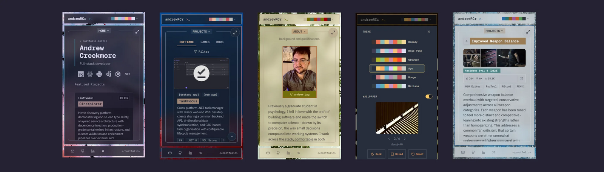

# andrewRCr Portfolio

A developer portfolio engineered as a production application. All content — project data, theme
definitions, and site configuration — flows through typed, validated data models. The multi-theme
design system persists user preferences to cookies via Server Actions, preventing flash of unstyled
content on page load. Accessibility is validated by automated testing across the component library
and every theme combination.

**Live:** [andrewcreekmore.dev](https://andrewcreekmore.dev)

  

## Highlights

- Type-safe content architecture with validated data models for project data, theme definitions,
  and site configuration
- Theme system built on semantic design tokens for color and layout, with WCAG AA contrast
  validation across all combinations
- Automated accessibility auditing with vitest-axe integrated across component test suites
- Responsive layouts with distinct compositions across viewports — CSS-only breakpoints for
  hydration safety
- Orchestrated animation system with centralized timing driving intro sequences, page transitions,
  and shared element morphing
- Built with [ARC Framework](https://github.com/andrewRCr/arc-agentic-dev-framework) — a
  spec-driven development methodology emphasizing focused human-agent collaboration

## Technology

| | |
| --- | --- |
| Framework | Next.js 16, React 19, TypeScript 5 (strict mode) |
| Styling | Tailwind CSS v4, Shadcn/ui, Framer Motion |
| Testing | Vitest, React Testing Library, Playwright |
| Infrastructure | Vercel, GitHub Actions CI, Upstash Redis |

## License

**Dual License:**

- **Code:** MIT License — source code is open source and free to use
- **Content:** CC BY-NC 4.0 — portfolio content (text, images, assets) requires attribution
  and is for non-commercial use

See [LICENSE](LICENSE) for full details.
